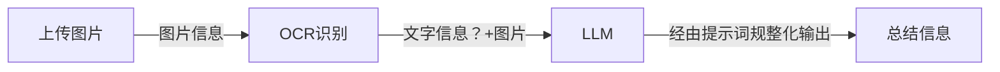

## 校园海报/宣传栏信息提取系统

### 1. 系统核心

1. **思路**： 借助**OCR+LLM**实现：
   - **OCR**：文字识别能力以及信息提取能力
   - **LLM**：信息总结以及报告整理能力
2. **框架**：LLM应用使用FastApi框架快速便捷
   - Web应用
   - FastAPI

### 2. 技术选型

- **后端**：FastAPI
- **前端**：vue
- **OCR技术**：PaddleOCR（一款百度的开源技术）
- LLM：deepseek

### 3. 系统流程

### 4. 样例展示

